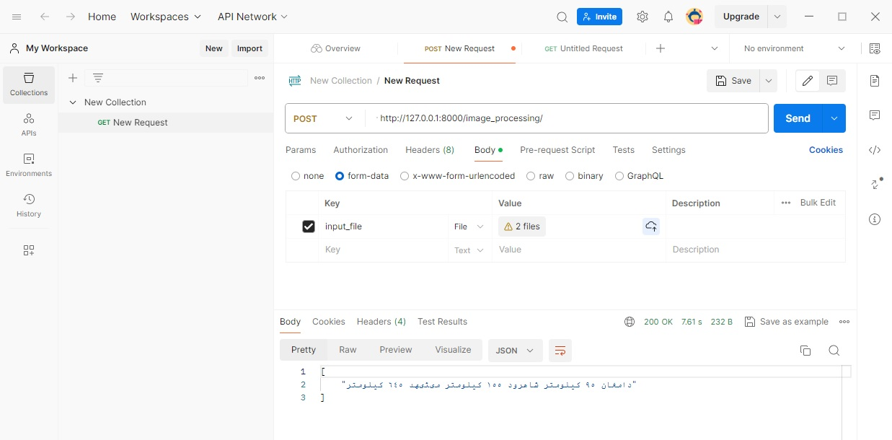

# Image Based APIs


## how to run ?
first of all run this command in terminal :

```
uvicorn ImageBased_API:app --reload
```


# 1. OCR API
EasyOCR is a python module for extracting text from image. It is a general OCR that can read both natural scene text and dense text in document. We are currently supporting 80+ languages and expanding.
 

http://127.0.0.1:8000/image_processing/
```


# ------------------------------------------------------------------------------------------------------------
