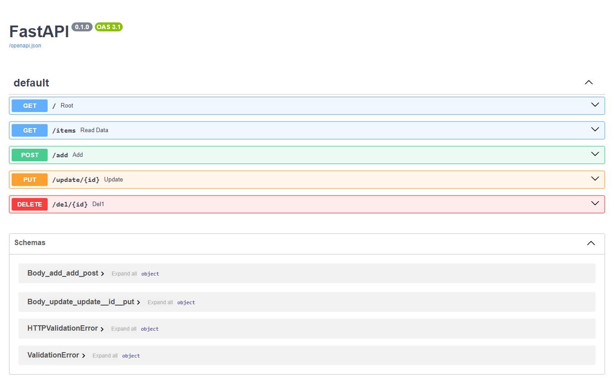

## To do API  
Welcome to the Todo API! with This API you can manage your work . the name of the database is (todo.db). You also can do (Create, Read, Update, Delete) operations on todo items using this API.  

  

### How to install  
```
pip install -r requirements.txt
```  
### Getting Started  

uvicorn main:app
```  
The base URL of the API endpoints is : 127.0.0.1:8000  
#### Endpoints  
* GET /task: Retrieves all todo items.
* POST /task: Creates a new todo item.
* PUT /task/id: Updates an existing todo item by its ID.
* DELETE /task/id: Deletes a todo item by its ID.

