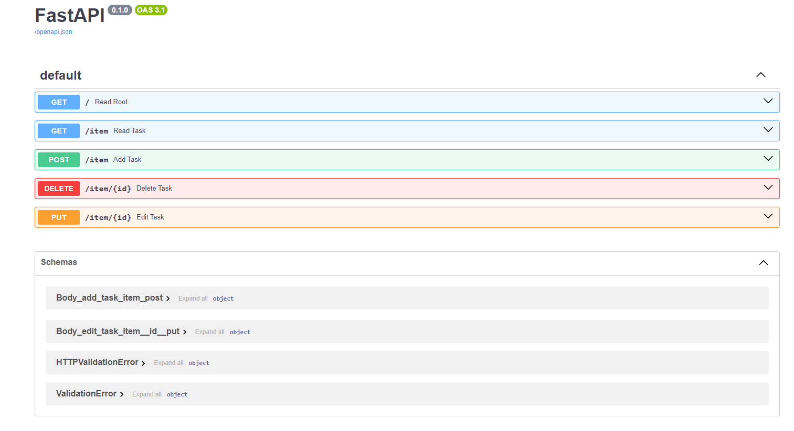

# FastAPI - Docker 

# Description :
We design a application base on Fastapi and Docker and uploaded on Liara .
<br>

# How to install :
```
pip install -r requirements.txt
```

# How to run :
```
https://todo-docker-2024.liara.run/docs
```

liara's docs :




## Create Docker for FastAPI :
```
# 
FROM python

# 
WORKDIR /code

# 
COPY ./requirements.txt /code/requirements.txt

# 
RUN pip install --no-cache-dir --upgrade -r /code/requirements.txt

# 
COPY ./app /code/app

# 
CMD ["uvicorn", "app.main:app", "--proxy-headers", "--host", "0.0.0.0", "--port", "80"]
```

--------------------------------
<br>


